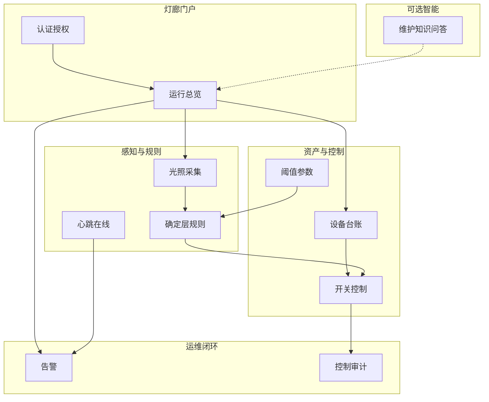
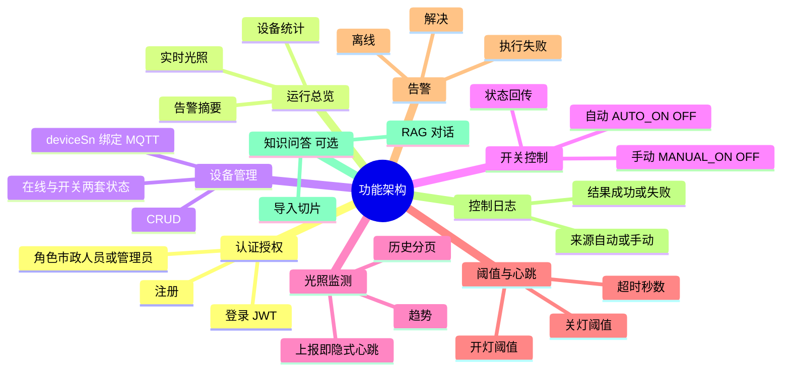

# 智慧路灯 — 功能架构

> 按业务能力拆模块，对应后端 Controller / 前端页面，而不是按技术栈堆砌。

## 1. 功能架构总图

## 2. 功能模块思维导图

## 3. 模块 ↔ 实现落点

| 功能模块 | 前端 | 后端 | 说明 |
|----------|------|------|------|
| 认证 | `/login` | `/users/register` `/users/login` | Header `token` |
| 总览 | `/dashboard` | 设备统计、最新光照、WS | Mock 可用定时器冒充 WS |
| 设备 | `/devices` | `/devices` CRUD、heartbeat、status-callback | `ON/OFF` ≠ `ONLINE/OFFLINE` |
| 开关 | 设备页按钮 | `/devices/{id}/switch` + MQTT command | 确定层也走同一套状态更新 |
| 光照 | `/lights` | `/light-readings` | 上报触发阈值判定 |
| 阈值 | `/threshold` | `/threshold-config` | 通常一行配置 |
| 告警 | `/alarms` | `/alarm-logs` | 定时任务或硬件创建 |
| 日志 | `/logs` | `/control-logs` | 审计 |
| 问答 | 未作为主航线 | `/knowledge-chunks` | Could，不挡 MVP |

## 4. 能力链（采集到呈现）

每个 Must 功能都走同一条链中的若干环：

| 功能 | 采集 | 上报 | 存储 | 规则 | 下发 | 呈现 |
|------|------|------|------|------|------|------|
| 自动开关 | 光照传感器 | MQTT/HTTP light | light_readings + devices | 比阈值 | command | 灯廊开关态 |
| 手动开关 | 人点按钮 | HTTP switch | devices + control_logs | 鉴权 | command | 列表刷新 |
| 离线告警 | 心跳/光照时间 | heartbeat 或隐式 | devices + alarm_logs | 超时扫描 | — | 告警页 + WS |
| 趋势 | 历史光照 | — | light_readings | — | — | 折线图 |

## 5. 与物流的边界

功能架构 **不含** 运单、司机、GPS 轨迹。目录名 `wuliu` 不改变本图范围。
