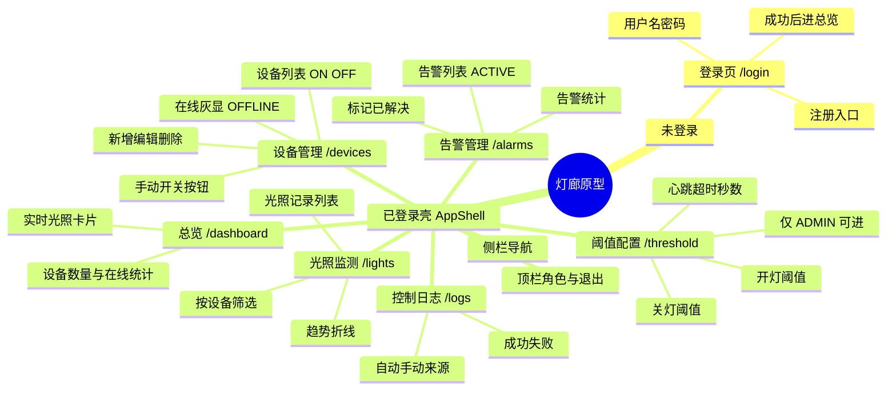
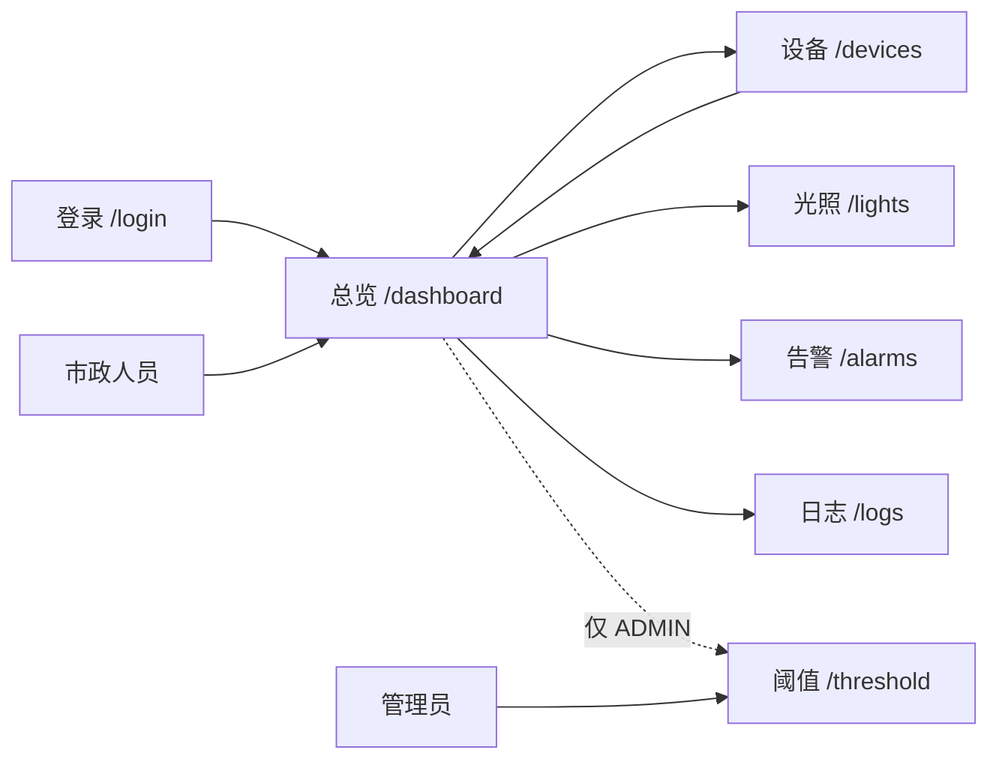
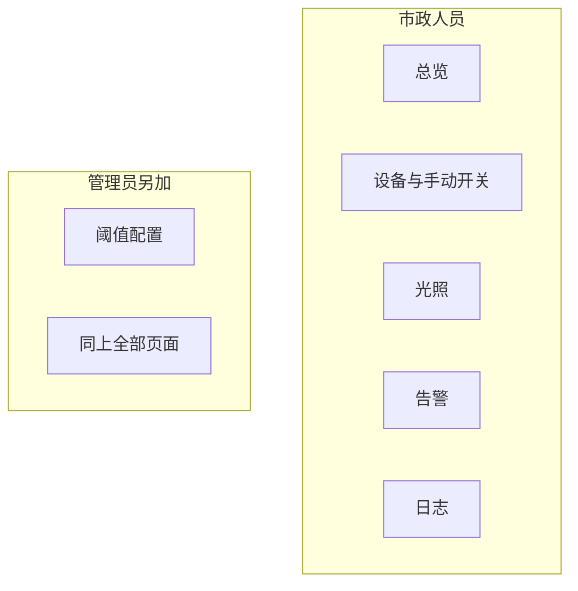

# 智慧路灯 — 原型图（页面思维导图）

> 按实际前端路由 `web/src/router/index.ts` 整理，对应「灯廊」低保真信息结构，不是视觉稿。  
> 预览本文件即可把思维导图当成原型站点地图。

## 1. 整站信息架构



## 2. 页面跳转原型



未登录访问业务页 → 拉回 `/login`。市政人员点阈值 → 退回总览。

## 3. 各页原型要点（线框级）

### 登录 `/login`

- 表单：用户名、密码  
- 操作：登录、注册  
- 无侧栏  

### 总览 `/dashboard`

```text
+------------------+------------------+
| 设备总数 / 在线   | 告警活跃数        |
+------------------+------------------+
| 最新光照（实时刷新，Mock 或 WS）      |
+-------------------------------------+
```

### 设备 `/devices`

```text
[新增设备]  筛选：名称 / 开关 / 在线
--------------------------------
名称 | SN | 开关 | 在线 | 心跳时间 | 开/关 | 编辑 | 删
```

### 光照 `/lights`

```text
设备筛选 | 时间范围
列表：时间、设备、光照值
下方：趋势图
```

### 告警 `/alarms`

```text
类型 OFFLINE 等 | 状态 ACTIVE/RESOLVED
行操作：解决
```

### 阈值 `/threshold`（管理员）

```text
开灯阈值 lightThresholdOn
关灯阈值 lightThresholdOff
心跳超时 heartbeatTimeout
[保存]
```

### 日志 `/logs`

```text
时间 | 设备 | AUTO/MANUAL | ON/OFF | 结果
```

## 4. 角色 × 页面



默认 Mock 账号见 `web/README.md`：`admin` / `admin123`，`staff` / `staff123`。
