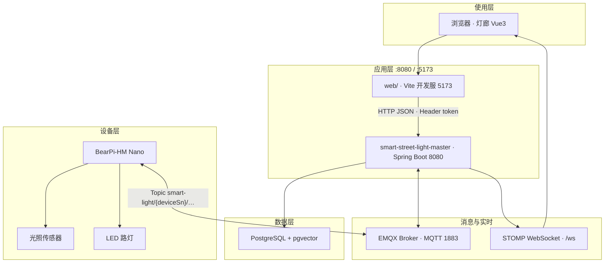
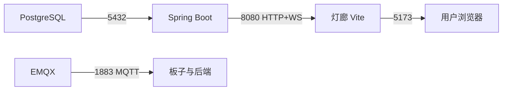
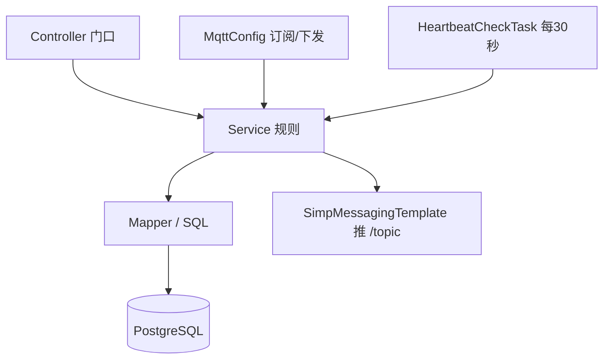

# 智慧路灯 — 技术架构图

> 依据当前仓库：端侧 BearPi、云端 Spring Boot、Web「灯廊」、PostgreSQL、EMQX。  
> 契约真源：`smart-street-light-master/API文档.md`。

## 1. 总体技术架构

## 2. 分层说明

| 层 | 技术 | 仓库位置 | 职责 |
|----|------|----------|------|
| 表现 | Vue 3、Vue Router、Pinia、Vite | `web/` | 登录、总览、设备、光照、告警、阈值、日志；默认可 Mock |
| 应用 | Spring Boot 3、JWT、MyBatis-Plus | `smart-street-light-master/` | REST、阈值判定、心跳扫描、MQTT 下发、WS 推送 |
| 消息 | MQTT（EMQX）、STOMP/WebSocket | 实验室 Docker / 后端配置 | 灯↔云上报与指令；云→浏览器实时刷新 |
| 数据 | PostgreSQL、pgvector | `sql/schema.sql` | 用户、设备、光照、控制日志、阈值、告警、知识块 |
| 设备 | BearPi + 传感器 + LED | `firmware/`（源码多在板端本机） | 采光、心跳、执行开关、状态回传 |

## 3. 通信端口（本机/实验室常见）

## 4. 后端内部（经典三层）

确定层在 Service：光照比阈值 → `AUTO_ON` / `AUTO_OFF`；心跳超时 → `OFFLINE` + 告警。网页与板子都不自己算规则。
