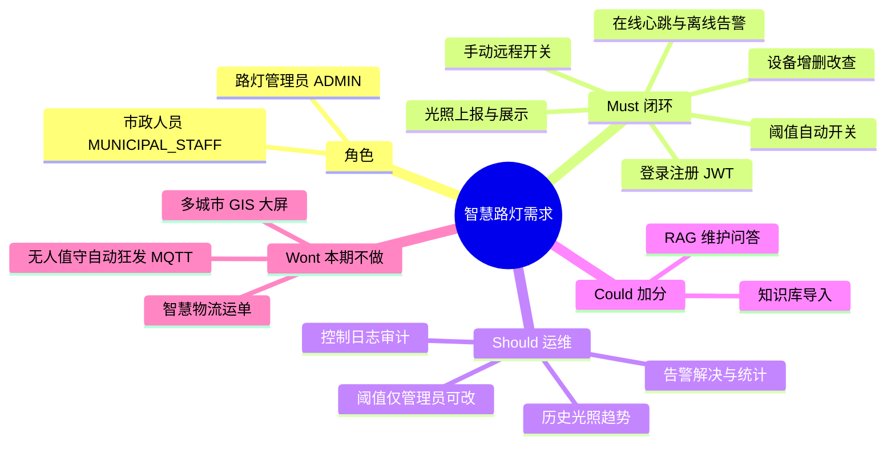
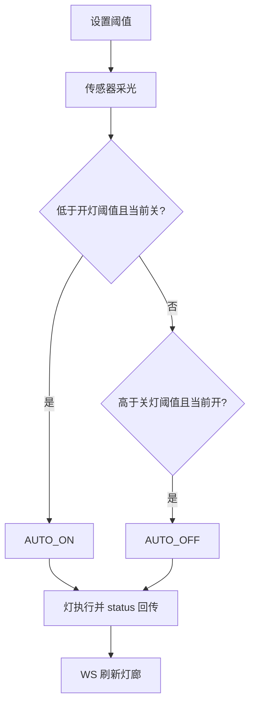

# 智慧路灯 — 需求清单

> 对齐 `smart-street-light-master/智慧路灯_基本功能清单.md` 与 `CONTEXT.md`。  
> **主交付**是物联网闭环；RAG 维护问答为可选项，不挡 MVP。

## 1. 需求总览（思维导图）

## 2. 角色与目标

| 角色 | 标识 | 核心诉求 |
|------|------|----------|
| 市政人员 | `MUNICIPAL_STAFF`（默认注册） | 看光照、看在线、手动开关、收离线告警 |
| 路灯管理员 | `ADMIN` | 管设备、改阈值、看告警与日志、可选知识问答 |

## 3. MoSCoW 清单

### Must（演示约 3 分钟必须能讲清）

| ID | 需求 | 验收要点 |
|----|------|----------|
| M1 | 设备可登记，有 `deviceSn` | 能新增/列表/区分 SN |
| M2 | 光照能上报并在控制台看到 | MQTT 或 HTTP `POST /light-readings` 后列表或总览有数 |
| M3 | 低于开灯阈值自动开、高于关灯阈值自动关 | 后端下发 `AUTO_ON` / `AUTO_OFF`，灯状态更新 |
| M4 | 网页可手动开关 | `POST /devices/{id}/switch`，日志记 MANUAL |
| M5 | 心跳超时标离线并告警 | 定时任务 + `heartbeatTimeout` |
| M6 | 用户登录，请求带 `token` | 成功 `code=200` |

### Should

| ID | 需求 | 说明 |
|----|------|------|
| S1 | 历史光照趋势图 | 对应光照监测页 |
| S2 | 告警列表与「已解决」 | 离线、执行失败等 |
| S3 | 控制日志 | 自动/手动可追溯 |
| S4 | 阈值配置仅 ADMIN | 路由 `meta.admin` |

### Could

| ID | 需求 | 说明 |
|----|------|------|
| C1 | `/knowledge-chunks` RAG 问答 | 不挡主闭环 |
| C2 | 知识文档导入 | 向量检索可后补 |

### Won't（本期明确不做）

- 智慧物流运单、五角色、GPS 轨迹  
- 把 LLM 做成开灯的主决策器  
- 提交板端 OpenHarmony 整树、密钥文件  

## 4. 用户故事对照

| 作为… | 我希望… | 以便… | 优先级 |
|--------|---------|--------|--------|
| 市政人员 | 实时看光照 | 了解道路照明 | Must |
| 市政人员 | 看历史光照 | 分析规律 | Should |
| 市政人员 | 按光照自动开关灯 | 少跑现场 | Must |
| 市政人员 | 手动远程开关 | 应急灵活 | Must |
| 市政人员 / 管理员 | 设置开关阈值 | 调灵敏度 | Must（改配置偏 ADMIN） |
| 市政人员 | 看在线状态 | 知道灯还在不在 | Must |
| 市政人员 | 收离线告警 | 及时维修 | Must |
| 管理员 | 统一管理路灯 | 增删设备 | Must |
| 管理员 | 查看告警记录 | 追溯问题 | Should |
| 管理员 | 对话咨询维护知识 | 排障指导 | Could |

## 5. 关键流程（需求级）

离线：心跳超过 `heartbeatTimeout` → `OFFLINE` → 告警 → 管理员维修 → 再上报则恢复 `ONLINE`。
